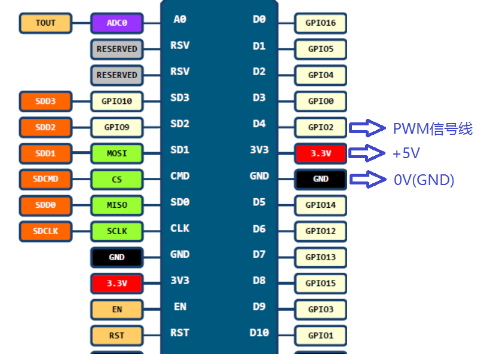
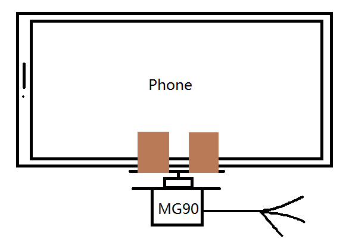

# Android Camera Object Tracker

本仓库基于Android + NodeMCU平台实现物体检测与跟踪，AI能力来自Google MLKit。

## 特征

* 在屏幕上选择相应的目标矩形开始跟踪，app内部会根据重力传感器、屏幕大小等因素进行坐标转换保证传递给算法库的图像(剪裁区域、方向)与用户所感知的一致。

* 当物体在画面中过大或过小时，自动缩放以匹配大小。

* 当物体即将离开画面左右侧时，自动旋转舵机以避免目标离开画面。

* 当目标跟丢后，自动在周围寻找类似的物体。(根据ML Model的分类Label)

* 支持视频录制(由于CameraX库的限制，<u>需要设备相机级别达到LEVEL-3</u>)

## 编译

本仓库分为 Android App 和 单片机 两部分。

### Android App

直接使用Gradle Build或者<u>Android Studio(推荐)</u>进行编译即可。

>由于APP使用Jetpack Compose库构建UI界面，请使用较高版本的Android Studio(Arctic Fox+)。

### 单片机

#### 硬件清单

* MG90(<u>0-180度</u> 全金属)
* NodeMCU Lua V3(CH340串口,串口不同应该不影响)

#### 硬件连线

>蓝色箭头表示连接至舵机对应的PIN脚

#### 固件烧写

连接MicroUSB线后使用Arduino IDE加载/OT/OT.ino刷入即可。

>需要安装驱动和IDE依赖，请自行网上检索。

#### 手机固定

暂时用两条胶带把手机贴到舵机的转杠上就OK了。

## 运行

单片机通电后会发出一个SSID为tracker(密码tracker123)的WIFI信号，手机连接后打开APP即可。

## 改进

* 本仓库所使用的ML Model是从[TensorFlow Hub](https://tfhub.dev/)上找的，支持的分类多但好像不大可靠。可以考虑[训练和加载自己的模型](https://developers.google.cn/ml-kit/custom-models)。

* 使用360度舵机获得更大的跟踪范围。

## 参考

[MLKit](https://developers.google.cn/ml-kit/vision/object-detection/custom-models/android)